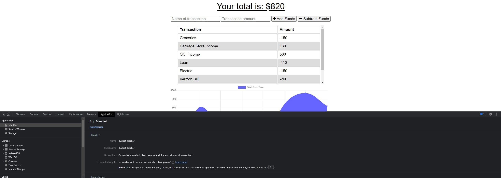

# Budget Tracker

## Description

This project is an application that allows users to add expenses and deposits to their budget with or without a connection. If the user enters transactions offline, the changes will be reflected when they're brought back online. This application uses IndexDB, service workers, and Web Manifest for offline functionality and is deployed on Heroku.

## Installation

No installation required, simply clone the repository and install dependencies with `npm i` then run the server with `npm start`

## Usage

This application will allow users to create new transactions whether it's a deposit or withdrawal. You can do this while online or offline. Please view the deployed application on [Heroku](https://budget-tracker-pwa-nork.herokuapp.com/)

Here's a screenshot displaying PWA functionality

## Credits

Starter Code: https://github.com/coding-boot-camp/symmetrical-bassoon

Heroku/MongoDB deploy: https://www.mongodb.com/developer/products/atlas/use-atlas-on-heroku/
